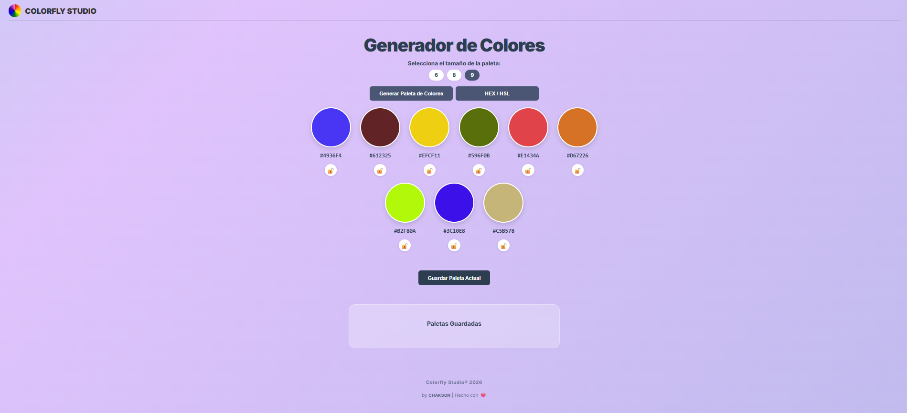

🎨 Colorfly Studio®

**🌐 Ver Proyecto en Vivo:** [Probá la aplicación haciendo clic acá](https://chak-son.github.io/ProyectoM1_Pasquini_Claudio/)

**Colorfly Studio®** es una herramienta web moderna y minimalista para la generación de paletas de colores. Diseñada con un enfoque en la pureza del código y la experiencia de usuario, permite encontrar la combinación cromática perfecta en segundos.

Desarrollado por **Chakson** | Hecho con ❤️

---

## 📸 Vista Previa

---

## 📂 Estructura del Proyecto

ProyectoM1_Pasquini_Claudio/

┣ 📁 imagenes/

┃ ┗ 📸 foto.png — Recursos visuales

┣ 📄 index.html — Estructura semántica (HTML5)

┣ 🎨 styles.css — Estilos y animaciones (CSS3)

┣ ⚡ script.js — Lógica y persistencia (JS ES6+)

┗ 📖 README.md — Documentación del proyecto

---

## 🛠️ Instrucciones de Uso

Para aprovechar al máximo **Colorfly Studio®**, sigue estos pasos:

* **Selecciona el tamaño:** Elige entre una paleta de 6, 8 o 9 colores usando los botones superiores.
* **Genera colores:** Haz clic en el botón "Generar Paleta de Colores" para obtener una nueva combinación aleatoria.
* **Cambia el Formato:** Usa el botón **HEX / HSL** para alternar instantáneamente la visualización de los códigos de color.
* **Bloquea tus favoritos:** Haz clic en el icono del candado debajo del círculo para mantenerlo fijo.
* **Copia los códigos:** Haz clic directamente sobre el código HEX o HSL para copiarlo automáticamente.
* **Guarda tu paleta:** Presiona "Guardar Paleta Actual" para verla en la sección inferior.

---

## 💻 Cómo probarlo en tu PC

Tienes dos formas de tener este proyecto en tu computadora:

### Opción A: Descarga Directa (Más fácil)
1. En la parte superior de este repositorio, haz clic en el botón verde **Code**.
2. Selecciona **Download ZIP**.
3. Extrae los archivos en una carpeta y abre el archivo **index.html**.

### Opción B: Usando la Terminal (Requiere Git)
Si eres desarrollador, puedes clonar el repositorio directamente usando este comando:
`git clone https://github.com/Chak-son/ProyectoM1_Pasquini_Claudio.git`

---

## ✨ Características y Tecnologías

* **Código Semántico:** Desarrollado 100% sin etiquetas div, utilizando exclusivamente HTML5 semántico.
* **Modo Dual:** Soporte nativo para formatos **HEX y HSL**.
* **Persistencia:** Uso de LocalStorage para que tus paletas no se borren.
* **Diseño Responsive:** Organización visual inteligente que se adapta a diferentes pantallas.
* **Tecnologías:** HTML5, CSS3 y JavaScript ES6+.

---

## 🚀 Próximas Mejoras
* Exportación: Opción para descargar la paleta en formato PDF o imagen PNG.

* Modo Contraste: Sistema de validación automática para asegurar que los colores generados cumplan con normas de accesibilidad (WCAG).

* Temas Predeterminados: Filtros para generar paletas específicamente cálidas, frías o pasteles.

---

## ⚖️ Créditos
**Colorfly Studio® 2026** - Todos los derechos reservados.

Diseño y desarrollo por **Chakson**.